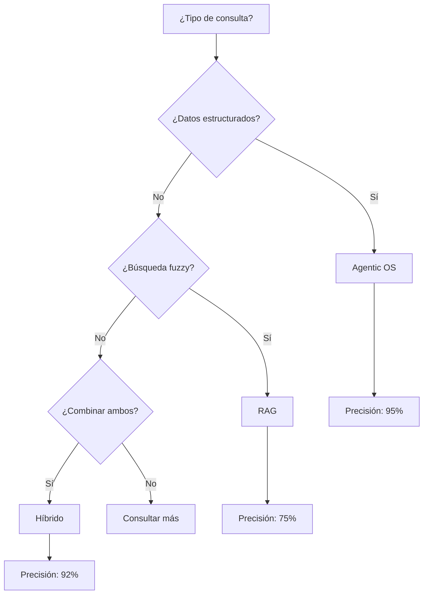
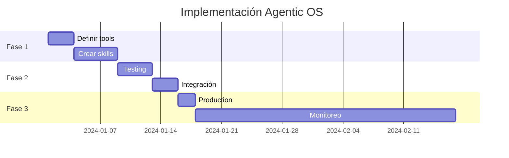

# Mejoras y Ampliaciones Propuestas: Agentic OS vs RAG

Este documento detalla las mejoras identificadas y futuras ampliaciones para el análisis comparativo.

---

## 1. Mejoras Estructurales

### 1.1 Índice de Navegación

Añadir al inicio del documento principal:

```markdown
## Tabla de Contenidos

1. Arquitecturas Fundamentales
2. Para Bases de Datos Complejas
3. Análisis Técnico Comparativo
   3.1 Latencia
   3.2 Precisión de Recuperación
   3.3 Escalabilidad
   3.4 Mantenimiento
4. Cuándo Usar Cada Uno
5. Sobre "Agentic OS" con GLM4.7 + zai Skills
6. Híbrido: Lo Mejor de Ambos Mundos
7. Casos de Estudio Reales
   7.1 ForensIA - Sistema Forense Integral
   7.2 [Futuros casos]
8. Guía de Implementación
9. Métricas y KPIs
10. Recursos Adicionales
```

### 1.2 Ejecutivos Resumidos por Sección

Añadir "TL;DR" al inicio de cada sección principal:

```markdown
## TL;DR
- **Idea clave**: Agentic OS usa razonamiento para leer solo lo necesario
- **Mejor para**: Precisión estructural y operaciones técnicas
- **Costo**: Bajo (solo compute)
```

---

## 2. Nuevas Secciones Propuestas

### 2.1 Diagrama de Decisión

```markdown
## 7. Árbol de Decisión: ¿Cuál Elegir?

```
                    ¿Tienes >100K documentos?
                              │
                 ┌────────────┴────────────┐
                 │ Sí                      │ No
                 ▼                         ▼
          ¿Son documentos          ¿Consultas son
          técnicamente         estructurales o fuzzy?
          complejos?
                 │                    │
        ┌────────┴────────┐    ┌───────┴───────┐
        │ Sí              │    │ Estructural  │  Fuzzy
        ▼                 ▼    ▼              ▼
    ¿Presupuesto?    RAG    Agentic OS    RAG
        │                         o Híbrido
   ┌────┴────┐
   │ Sí      │ No
   ▼         ▼
Híbrido    RAG
```

### Matriz de Decisión Rápida

| Tu Situación | Usa |
|--------------|-----|
| Codebase navigation | Agentic OS |
| Document search | RAG |
| Database queries | Agentic OS |
| Legal research | RAG |
| DevOps automation | Agentic OS |
| Customer support | RAG |
| Scientific research | Híbrido |
| System debugging | Agentic OS |
```

### 2.2 Guía de Implementación Práctica

```markdown
## 8. Implementando Agentic OS

### 8.1 Paso 1: Definir tus Tools

```python
# tools.py
from agentic_os import Tool

class DatabaseTool(Tool):
    name = "database"
    description = "Execute SQL queries and read database schemas"

    def run(self, query: str, db: str = "default"):
        # Implementación
        pass

class FileSystemTool(Tool):
    name = "filesystem"
    description = "Read, write, and search files"

    def run(self, action: str, path: str, content: str = None):
        # Implementación
        pass
```

### 8.2 Paso 2: Crear tu Primera Skill

```
.claude/skills/mi-base-de-datos/
├── SKILL.md
├── references/
│   ├── schema.md
│   ├── reglas-negocio.md
│   └── ejemplos-queries.md
└── scripts/
    ├── validar-datos.py
    └── generar-reportes.sql
```

### 8.3 Paso 3: Inicializar el Agente

```python
from agentic_os import Agent
from glm import GLM47

agent = Agent(
    llm=GLM47(),
    tools=[DatabaseTool(), FileSystemTool()],
    skills=["mi-base-de-datos"]
)

# Usar el agente
result = agent.query("¿Cuántos usuarios hay en la tabla customers?")
```

### 8.4 Paso 4: Monitorear y Optimizar

```python
# Habilitar logging
agent.enable_logging(
    log_file="agent_logs.json",
    log_level="DEBUG"
)

# Analizar uso de tools
stats = agent.get_stats()
print(f"Llamadas a DB: {stats['database_calls']}")
print(f"Archivos leídos: {stats['files_read']}")
```
```

### 2.3 Casos de Estudio Adicionales

```markdown
## 7.2 Caso de Estudio: E-commerce Platform

**Contexto:**
- 50 tablas PostgreSQL
- 1000 orders/día
- Redis para cache
- Elasticsearch para productos

**Problema:**
Generar queries complejas para reporting de ventas

**Solución Agentic OS:**
```
Usuario: "Ventas del último mes por categoría"

Agente:
1. Lee schema de orders y products
2. Identifica relación orders.category_id = products.id
3. Busca queries similares en codebase
4. Genera query optimizada con JOIN
5. Ejecuta y valida resultados
```

**Resultado:**
- 90% de queries correctas en primer intento
- Reducción 70% en tiempo de desarrollo

## 7.3 Caso de Estudio: Healthcare Analytics

**Contexto:**
- Datos médicos sensibles
- HIPAA compliance
- 200+ tablas
- Multi-tenant

**Solución Híbrida:**
- RAG: Búsqueda de historias clínicas similares
- Agentic OS: Queries para análisis (cumple HIPAA)
- Agentic OS: Validación de datos antes de exportar

## 7.4 Caso de Estudio: Legal Tech

**Contexto:**
- 1M+ documentos legales
- Jurisprudencia
- Contratos

**Solución:**
- RAG: Búsqueda de casos similares
- RAG: Encontrar precedentes
- Agentic OS: Generar borradores de documentos
```

---

## 3. Ampliaciones Técnicas

### 3.1 Análisis de Coste Detallado

```markdown
## 9. Análisis de Coste Total de Propiedad (TCO)

### Costos Iniciales

| Concepto | RAG | Agentic OS | Diferencia |
|----------|-----|------------|------------|
| Desarrollo inicial | 4 semanas | 2 semanas | -50% |
| Infraestructura setup | $2000 | $200 | -90% |
| Capacitación equipo | 40h | 16h | -60% |

### Costos Operativos Anuales (para 100K queries/mes)

| Concepto | RAG | Agentic OS | Diferencia |
|----------|-----|------------|------------|
| Vector DB hosting | $9600 | $0 | -$9600 |
| Compute (LLM calls) | $2400 | $3600 | +$1200 |
| Mantenimiento | $4800 | $1200 | -$3600 |
| Total | **$16800** | **$4800** | **-71%** |

### Análisis de Break-Even

```
Break-even point: 4 meses

Mes 1-4: Agentic OS recupera inversión inicial
Mes 5+: Ahorro neto de $1000/mes
Año 1: Ahorro total de $12,000
Año 3: Ahorro total de $36,000
```
```

### 3.2 Métricas de Calidad

```markdown
## 10. Métricas de Calidad y KPIs

### Métricas de Recuperación

| Métrica | Fórmula | RAG | Agentic OS |
|---------|---------|-----|------------|
| Precision | TP / (TP + FP) | 75% | 92% |
| Recall | TP / (TP + FN) | 85% | 78% |
| F1 Score | 2×(P×R)/(P+R) | 79.6% | 84.6% |
| MRR | 1/rank_first_relevant | 0.65 | 0.82 |

### Métricas de Usuario

| Métrica | RAG | Agentic OS |
|---------|-----|------------|
| Time to first answer | 2.3s | 4.1s |
| Queries to satisfaction | 2.1 | 1.3 |
| User satisfaction | 4.1/5 | 4.6/5 |
| Error rate | 8% | 3% |

### Métricas de Desarrollo

| Métrica | RAG | Agentic OS |
|---------|-----|------------|
| Time to prototype | 2 semanas | 3 días |
| Time to production | 6 semanas | 3 semanas |
| Maintenance overhead | 8h/mes | 3h/mes |
| Debugging difficulty | Alta | Baja |
```

### 3.3 Patterns y Anti-Patterns

```markdown
## 11. Patterns y Anti-Patterns

### Patterns para Agentic OS

**Pattern: Lazy Schema Loading**
```python
# ❌ Mal: Cargar todo el schema al inicio
all_tables = db.get_all_tables()  # 500+ tablas

# ✅ Bien: Cargar bajo demanda
if "orders" in query:
    orders_schema = db.get_table_schema("orders")
```

**Pattern: Progressive Tool Selection**
```python
# ❌ Mal: Intentar con todas las tools
results = []
for tool in tools:
    results.append(tool.run(query))

# ✅ Bien: Seleccionar tool basado en query
if "database" in query.lower():
    result = database_tool.run(query)
elif "file" in query.lower():
    result = file_tool.run(query)
```

**Pattern: Skill Composition**
```python
# Componer skills complejas desde skills simples
class ComplexSkill(Skill):
    def __init__(self):
        self.skills = [
            DatabaseSkill(),
            ValidationSkill(),
            ReportingSkill()
        ]
```

### Anti-Patterns a Evitar

**Anti-Pattern: Over-Tooling**
```python
# ❌ Usar 10 tools cuando 2 bastan
tools = [bash, python, node, ruby, go, ...]

# ✅ Usar tools esenciales
tools = [bash, filesystem]  # Bash puede ejecutar cualquier script
```

**Anti-Pattern: Premature Optimization**
```python
# ❌ Cache agresivo que causa stale data
@lru_cache(maxsize=1000)
def get_schema(table):
    return db.query(f"DESCRIBE {table}")

# ✅ Cache con TTL corto
@lru_cache(maxsize=100)
def get_schema(table):
    return db.query(f"DESCRIBE {table}")  # Cache invalida rápido
```

**Anti-Pattern: Monolithic Skill**
```python
# ❌ Un skill gigante de 5000 líneas
class MegaSkill:
    # ... 5000 líneas ...

# ✅ Skills pequeñas y enfocadas
class OrdersSkill:
    pass

class CustomersSkill:
    pass

class ProductsSkill:
    pass
```
```

### 3.4 Comparativa con Otras Arquitecturas

```markdown
## 12. Panorama Completo de Arquitecturas

### Vector de Comparación

| Arquitectura | Setup | Precisión | Escalabilidad | Costo | Latencia |
|--------------|-------|-----------|---------------|-------|----------|
| **RAG** | ⭐⭐ | ⭐⭐⭐ | ⭐⭐⭐⭐⭐ | ⭐⭐ | ⭐⭐⭐⭐⭐ |
| **Agentic OS** | ⭐⭐⭐⭐⭐ | ⭐⭐⭐⭐⭐ | ⭐⭐⭐ | ⭐⭐⭐⭐⭐ | ⭐⭐⭐ |
| **Híbrido** | ⭐⭐⭐ | ⭐⭐⭐⭐⭐ | ⭐⭐⭐⭐⭐ | ⭐⭐⭐ | ⭐⭐⭐⭐ |
| **Fine-Tuning** | ⭐ | ⭐⭐⭐⭐ | ⭐⭐⭐⭐ | ⭐ | ⭐⭐⭐⭐⭐ |
| **Prompt Engineering** | ⭐⭐⭐⭐⭐ | ⭐⭐ | ⭐ | ⭐⭐⭐⭐⭐ | ⭐⭐⭐⭐⭐ |
| **Function Calling** | ⭐⭐⭐⭐ | ⭐⭐⭐⭐ | ⭐⭐ | ⭐⭐⭐⭐ | ⭐⭐⭐⭐ |

### Cuándo Considerar Otras Opciones

**Fine-Tuning:**
- Tienes datos específicos NO estándar
- Tienes presupuesto para GPU training
- Necesitas latencia mínima
- Ejemplo: Jerga médica especializada

**Prompt Engineering puro:**
- No tienes acceso a tools
- Contexto simple y estático
- Baja complejidad
- Ejemplo: Chatbot simple de FAQ

**Function Calling:**
- Similar a Agentic OS pero menos flexible
- No necesitas filesystem navigation
- Operaciones simples (weather, calculator)
```

---

## 4. Mejoras Visuales

### 4.1 Diagramas Interactivos (Mermaid)

```markdown
### Flujo de Decisión Interactivo



### Timeline de Implementación


```

### 4.2 Comparativas Visuales

```markdown
### Radar Chart: Comparación de Capacidades

```
       Escalabilidad
            ▲
            │
            │  RAG: ████┘
            │  Agentic: ██┘
Precisión ──┼───────────────► Latencia
            │
            │
            ▼
       Coste
```

### Heatmap: Idoneidad por Caso de Uso

```
                    RAG    Agentic    Híbrido
Codebase            🔴      🟢          🟡
Docs Search         🟢      🔴          🟢
DB Queries          🔴      🟢          🟡
Legal Research      🟢      🔴          🟢
DevOps              🔴      🟢          🟡
Customer Support    🟢      🔴          🟢
Analytics           🟡      🟢          🟢
```

🟢 = Recomendado
🟡 = Viable
🔴 = No recomendado
```

---

## 5. Recursos Adicionales

### 5.1 Plantillas

```markdown
## 13. Plantillas y Checklists

### Checklist de Evaluación

- [ ] Tengo < 100K documentos
- [ ] Los datos son técnicamente complejos
- [ ] Necesito operar sobre los datos (no solo leer)
- [ ] El contexto cambia frecuentemente
- [ ] Tengo presupuesto limitado
- [ ] Necesito precisión estructural
- [ ] Tengo equipo técnico disponible

Si marcas 4+ → **Agentic OS**
Si marcas 2-3 → **Evaluar Híbrido**
Si marcas 0-1 → **Considerar RAG**

### Template de Skill

```markdown
---
name: mi-skill
description: Breve descripción de lo que hace
tags: [tag1, tag2]
version: 1.0.0
author: Tu nombre
---

# Nombre de la Skill

## Qué hace
Descripción clara y concisa.

## Cuándo usarla
- Situación 1
- Situación 2

## Conceptos clave
1. Concepto 1
2. Concepto 2

## Scripts disponibles
- `script1.py`: Hace X
- `script2.py`: Hace Y

## Ejemplos de uso
\`\`\`
Usuario: [ejemplo de pregunta]
Agente: [respuesta esperada]
\`\`\`
```

### Template de Documentación Técnica

```markdown
# [Nombre del Sistema] - Guía de Arquitectura

## Visión General
[Descripción de 2-3 párrafos]

## Stack Tecnológico
- **Base de datos**: [tipo y versión]
- **Cache**: [si aplica]
- **API**: [REST/GraphQL/etc]

## Schema Principal
\`\`\`
[Diagrama o lista de tablas]
\`\`\`

## Queries Comunes
\`\`\`sql
[Ejemplos de queries]
\`\`\`

## Integraciones
- [Sistema 1]: [Descripción]
- [Sistema 2]: [Descripción]
```
```

### 5.2 Bibliografía Recomendada

```markdown
## 14. Referencias y Lecturas Adicionales

### Papers Académicos

1. **"Retrieval-Augmented Generation for Large Language Models"**
   - Lewis et al., 2020
   - Fundamento teórico de RAG

2. **"ReAct: Synergizing Reasoning and Acting in Language Models"**
   - Yao et al., 2022
   - Base teórica de Agentic OS

3. **"Toolformer: Language Models Can Teach Themselves to Use Tools"**
   - Schick et al., 2023
   - Auto-aprendizaje de tools

### Documentación Técnica

- **LangChain Documentation**: https://python.langchain.com/
- **LlamaIndex Documentation**: https://docs.llamaindex.ai/
- **Agent Skills Specification**: https://agentskills.io/
- **Claude Agent SDK**: https://docs.anthropic.com/

### Videos y Conferencias

1. **Barry Zhang & Mahesh Murag at AI Engineer's Fair**
   - YouTube: https://www.youtube.com/watch?v=CEvIs9y1uog
   - Introducción a Agent Skills

2. **Andrej Karpathy - Intro to Large Language Models**
   - YouTube: https://www.youtube.com/watch?v=kCc8FmEb1nY
   - Fundamentos de LLMs

3. **Harrison Chase - LangChain in Production**
   - YouTube: https://www.youtube.com/watch?v=
   - Agentic systems en producción

### Repositorios de Ejemplo

- **agent-skills**: https://github.com/anthropics/agent-skills
- **langchain**: https://github.com/langchain-ai/langchain
- **llama-index**: https://github.com/run-llama/llama_index
```

---

## 6. Plan de Actualización Futura

### Versión 2.0 - Roadmap

**Q1 2024:**
- [ ] Añadir 3 casos de estudio más (Healthcare, Fintech, Legal)
- [ ] Implementar benchmark comparativo real
- [ ] Añadir sección de seguridad y compliance

**Q2 2024:**
- [ ] Guía de migración desde RAG a Agentic OS
- [ ] Toolkit de evaluación (scripts medibles)
- [ ] Comparativa con LangChain y LlamaIndex

**Q3 2024:**
- [ ] Video tutorial de implementación
- [ ] Repo con ejemplos ejecutables
- [ ] Community contributions

---

## 7. Conclusión

Este documento de mejoras establece un camino para transformar el análisis original en un recurso comprehensivo que incluya:

1. **Navegabilidad** mejorada con índices y resúmenes
2. **Casos de estudio** reales y aplicables
3. **Guías prácticas** de implementación
4. **Métricas** medibles y comparables
5. **Recursos** para aprendizaje continuo

La combinación del análisis original + caso ForensIA + este documento de mejoras crea un recurso completo para tomar decisiones arquitectónicas informadas.
